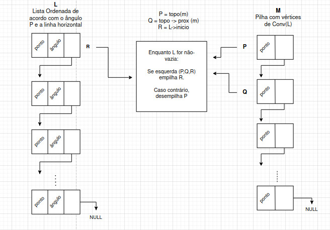
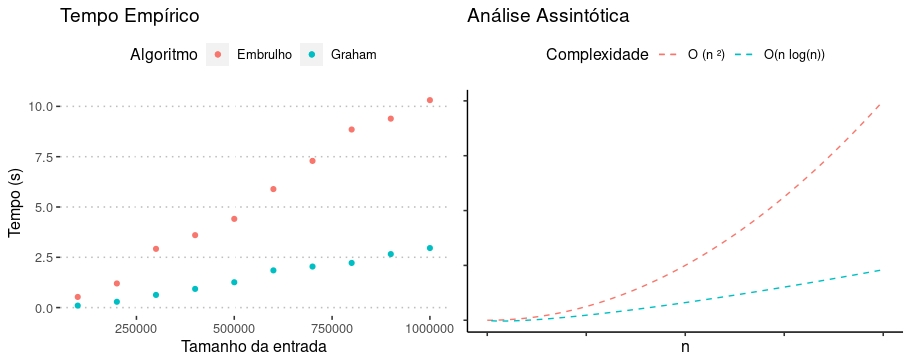

# Relatório do Projeto 1: Fecho convexo 
### SCC0223 - Estruturas de Dados I

##### Hiago Américo, nUSP: 11218469. Francisco Dias, nUSP: 4402962.

**Objetivo:** O cálculo do ***fecho convexo*** é um problema clássico de Geometria Computacional, sendo utilizado em inúmeras aplicações no dia-a-dia. O programa descrito neste relatório recebe como entrada um conjunto de pontos com coordenadas $(x,y)$ e devolve o fecho convexo deste conjunto, através dos algoritmos conhecidos como **Algoritmo de Embrulho** e **Algoritmo de Graham**.

## Modelagem

Ao longo deste relatório, explicaremos sucintamente os TADs utilizados, sendo também possível encontrar informações específicas de nossa implementação em linguagem C na documentação do código.

Uma de nossas primeiras decisões no escopo da modelagem do projeto foi utilizar *Listas Encadeadas Dinâmicas* para armazenar um conjunto $L$ de pontos, o qual temos como objetivo obter o respectivo fecho convexo, aqui também denominado $Conv(L)$. 

Uma das principais vantagens deste TAD é que não precisamos pré-definir um tamanho máximo para a quantidade de elementos, ficando este apenas à quantidade de memória principal disponível, não havendo alocação desnecessária de espaço, sendo de responsabilidade do programador a desalocação posterior dos elementos, para que não ocorram vazamentos de memória.

Em contrapartida, temos um maior grau de complexidade exigido para alocações no heap do que a acessos em elementos estáticos na memória. Além disso, não temos o acesso direto como teríamos a elementos armazenados dentro de um vetor, sendo necessário percorrer a lista com o uso de ponteiros auxiliares.

Uma das primeiras abordagens descritas pelos autores da área é conhecida como **Algoritmo do Embrulho**, que é uma solução simples e intuiva para o problema. Abaixo, um esboço em pseudo-código:
  
    escolha o ponto com menor coordenada y e inclua-o no fecho
    encontre o ponto que possua o menor ângulo entre o primeiro e a reta horizontal
        inclua-o no fecho
    
    para todos os outros pontos de L
      enquanto não incluir o ponto com menor y novamente, faça:
        encontre o ponto que possui maior ângulo e inclua-o no fecho

Além da lista ligada, para realizar esta implementação precisaremos de outros TADs auxiliares, para armazenar o ângulo entre os vetores visitados no processo iterativo para poder compará-los e encontrar o máximo ou mínimo deste conjunto, conforme ilustrado abaixo.

Embora este seja um método intuitivo para calcular o fecho convexo de um dado conjunto de pontos, ele não o faz da maneira mais eficiente do ponto de vista computacional: a cada iteração do algoritmo, queremos descobrir uma nova aresta pertencente ao fecho, num processo em que são necessárias $n$ chamados da primitiva de cálculo de ângulo.

Dessa forma, temos que o total de operações primitivas executadas é $O(nk)$, onde n é o número de pontos no conjunto e $k$ o total de arestas de $Conv(L)$. O menor número de vértices que um polígono pode ter são 3, que é nosso melhor caso, enquanto para o pior caso, $k = n$, resultando num tempo de execução quadrático. 

A segunda implementação proposta para resolver ao problema é conhecida como **Algoritmo de Graham**. Inicializado de maneira análoga ao algoritmo do embrulho, logo em seguida esta rotina de execução ordena ao vetor de ângulos formados, de forma crescente.

Em seguida, os pontos que podem fazer parte de $Conv(L)$ são sequencialmente empilhados, ou desempilhado-os caso se descubra que são pontos interiores, através de operações de comparações da primitiva esquerda. O processo é ilustrado abaixo. Ao final da execução, temos uma pilha de pontos que forma ao fecho convexo.

Uma de suas vantagens de um TAD do tipo *Pilha* é a realização de inserções e remoções de elementos em tempo constante, pois essas operações sempre são realizadas no topo. Assim, essa etapa do processo é realizada em tempo linear; o maior custo do Algoritmo de Graham é para ordenarmos o vetor, o que realizamos com auxílio do algoritmo MergeSort, em complexidade $O(n log n)$.

## Execução

Abaixo, uma relação das bibliotecas desenvolvidas na implementação do projeto, com uma breve descrição:

* main.c - programa principal, responsável por ler a entrada, chamar às funções e imprimir a saída. Os parâmetros de entrada e saída foram gerados conforme especificação do projeto, para serem enviados na plataforma *run.codes*.

* embrulho.h - contém as funções utilizadas para cálculo do fecho convexo através do Algoritmo de Embrulho;
* graham.h - contém as funções utilizadas para cálculo do fecho convexo através do Algoritmo de Graham;
* lista.h - contém as funções utilizadas para operações com o TAD *Lista Encadeada Dinâmica*;
* pilha.h - contém as funções utilizadas para operações com o TAD *Pilha*;
* primitivas.h - contém as operações primitivas com vetores para o cálculo do fecho convexo;
* mergesort.h - biblioteca do algoritmo de ordenação MergeSort para listas encadeadas;
* tempo.h - biblioteca para calcular o tempo tomado pelas operações.

O programa pode ser compilado através da diretiva `make all` e rodado através do comando `make run`. Para limpar os arquivos gerados pela compilação, utilize o comando `make clean`, conforme padrões vigentes da GNU Coding Standards.

## Análise de Eficiência

- Algoritmo do Embrulho
  - **Operações primitivas**: ângulo entre vetores, máximos e mínimos de um conjunto.
  - **Complexidade**: $O(nk)$, sendo $k$ o número de vértices do fecho.
  - **Estruturas envolvidas**: 
    - Lista Encadeada Dinâmica

- Algoritmo de Graham
    - **Operações primitivas**: ordenação. ângulo entre vetores.
    - **Complexidade**: $O(n log(n))$
    - **Estruturas envolvidas**: 
      - Lista Encadeada Dinâmica
      - Pilha

#### Complexidade das estruturas e operações envolvidas

  - Operações primitivas:
    - ângulo: $O(1)$
    - esquerda: $O(1)$
    - máximos e mínimos: $O(n)$
  - Operações de TAD:
    - Lista Ligada Dinâmica
      - inserção: $O(1)$
      - exclusão: $O(n)$
      - MergeSort: $O(n log(n))$
    - Pilha
      - empilhar, desempilhar, topo: $O(1)$
      - exclusão: $O(n)$ 

#### Análise de tempo do algoritmo

O tempo consumido pelo programa foi condizente com o esperado em nossa análise. É interessante notar que, para entradas pequenas, ambos quase não apresentam diferenças, que ficam evidentes somente em escala assintótica.

## Referências

1. *Geometria Computacional*. Disponível em <https://www.ime.usp.br/~freitas/gc/>. Acessado em 20 de outubro 2020.
2. *2D Convex Hulls*. Disponível em <http://www.ams.sunysb.edu/~jsbm/courses/345/13/lecture-convex-hulls-Chap2-devadoss-orourke.pdf>. Acessado em 20 de outubro 2020.
3. *Projeto de Algoritmos em C*. Disponível em <https://www.ime.usp.br/~pf/algoritmos/>. Acessado em 20 de outubro 2020.
4. *Merge Sort*. Disponível em <https://www.geeksforgeeks.org/merge-sort/>. Acessado em 20 de outubro 2020.