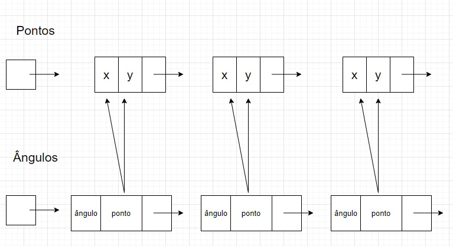

#  ESTRUTURAS DE DADOS 1
## Relatório do Projeto 1: Fecho convexo 
### Hiago Américo, nUSP: 11218469
### Francisco Dias, nUSP: 4402962
#### 1. Modelagem

Utilizamos dois tipos de algoritmos como resolução, sendo eles **Algoritmo de Embrulho** e **Algoritmo de Graham**. As Estruturas de Dados definidas para o uso são Lista Encadeada Dinâmica para o *Embrulho* e Pilhas para o *Graham*. Essas estruturas foram escolhidas pelo simples fato da simplicidade para o programador programar e o leitor entender como o algoritmo funciona através de uma ilustração. 

- **Vantagens**
    
As vantagens da *Lista Encadeada Dinâmica* é que não precisamos pré-definir um tamanho máximo para a lista, sendo assim o número de elementos da lista fica sempre limitado apenas à quantidade de memória principal disponível e não há alocação desnecessário de espaço. Ao acessar o dado apontado por um ponteiro **p** não requer cálculo de enderenço, como acontece quando utilizamos vetores. 
A vantagem da *Pilha* é fazer a inserção e remoção em tempo constante, sempre estará mexendo apenas no topo e com isso o tempo ficará constante.

- **Desvantagens**

É necessário percorrer  **i** nós para encontrar o i-ésimo elemento o que nos leva mais tempo para a execução do programa. E o consumo de tempo para alocação e liberação de memória emp operações de inserção e remoção. Ou seja, essa estrutura nos leva mais tempo.

- Explique  claramente e  detalhadamente a  lógica  utilizada  para  resolver  o problema. Como   as   estruturas (e respectivas   operações   básicas)   são utilizadas  para  representar  o  problema?  Qual  o  algoritmo  utilizado  para resolver o problema?

 
 

### 2. Implementação

Informação necessária para compilação e execução do programa, indicando quais arquivos são de TADs, programa principal e demais arquivos criados. 

Utilizamos seis arquivos TADs, sendo eles:

* embrulho.h - armazena as funções do **Algoritmo de Embrulho**;
* graham.h - armazena as funçẽos do **Algoritmo de Graham**;
* lista.h - armazena as funções padrões de uma *Lista*;
* pilha.h - armazena as funções padroẽs de uma *Pilha*;
* primitivas.h - armazena as funções responsáveis pelos cálculos;
* tempo.h - responsável por calcular o tempo do programa.

O programa principal é:

* main.c - responsável por ler a entrada do usuário

### 2. Análise de Eficiência e Relatório

- Medir tempo de execução
- gráfico de escalabilidade
- análise de complexidade utilizando O
- explicar o resultado, relacionando o algoritmo utilizado com a complexidade computacional do algoritmo implementado. Crescimento do tempo, melhor e pior casos.
  
